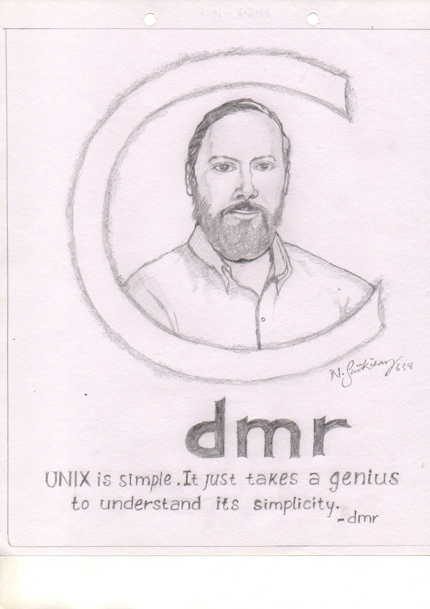

**If I have seen further it is by standing on the shoulders of Giants.**

I should have wrote this few years ago, when I was studying my graduation.
Because it was then I did all this.

See, for everything to be understood there needs a tiny spark of thought
that convinces you. That spark is very important. If you managed to get that
it means you understood well.

Generally I would give my first preference to a writing by the creator, if available.
For better understanding.

When we were spending lot of time on doing some stuff in HTML and feeling
happy. And worked with Python. Loved it.

Later introduced to C programming language. Felt unusual because at that
time transiting from Python to C is [difficult](2015-01-07-A-Difficult-thing-for-beginners.md)

As I was exploring C, I understood many concepts that make up software systems as we see them today.
Reading [ The C Programming Language ](https://www.goodreads.com/book/show/515601.The_C_Programming_Language) helped me soo much. That will always top my favorite book list.
It was so concise and precise.

After knowing all this. I had to do this drawing and stick in my class room.

And now UNIX. C language also played important role in developement of UNIX operating system.
Developed by  Ken Thompson, Dennis Ritchie and others. We all know that the [Unix philosophy](https://en.wikipedia.org/wiki/Unix_philosophy) will definitely guide us through better software developement.

You must see these videos about UNIX:
- [UNIX: Making Computers Easier To Use -- AT&T Archives film from 1982, Bell Laboratories](https://www.youtube.com/watch?v=XvDZLjaCJuw)
- [AT&T Archives: The UNIX Operating System](https://www.youtube.com/watch?v=tc4ROCJYbm0)

[UNIX pipe](https://en.wikipedia.org/wiki/Pipeline_(Unix)) contributed by Douglas McIlroy is still favorite of many people out there.
- [Unix Pipeline (Brian Kernighan) - Computerphile](https://www.youtube.com/watch?v=bKzonnwoR2I)

About bell labs:

- [The Factory of Ideas: Working at Bell Labs - Computerphile](https://www.youtube.com/watch?v=QFK6RG47bww)

About C language:

- ["C" Programming Language: Brian Kernighan - Computerphile](https://www.youtube.com/watch?v=de2Hsvxaf8M)
- [Why C is so Influential - Computerphile](https://www.youtube.com/watch?v=ci1PJexnfNE)

[UNIX tutorials](http://www.ee.surrey.ac.uk/Teaching/Unix/unixintro.html)

- [Dennis M. Ritchie](https://www.bell-labs.com/usr/dmr/www/)

There are so many gaints and I don't even know their names even you don't.
But they shall be remembered.

[CHRONOLOGICAL LISTING OF A.M. TURING AWARD WINNERS](https://amturing.acm.org/byyear.cfm)